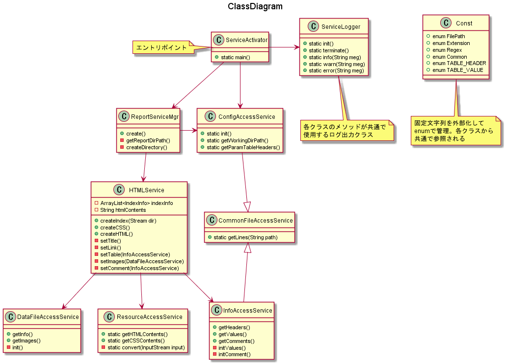
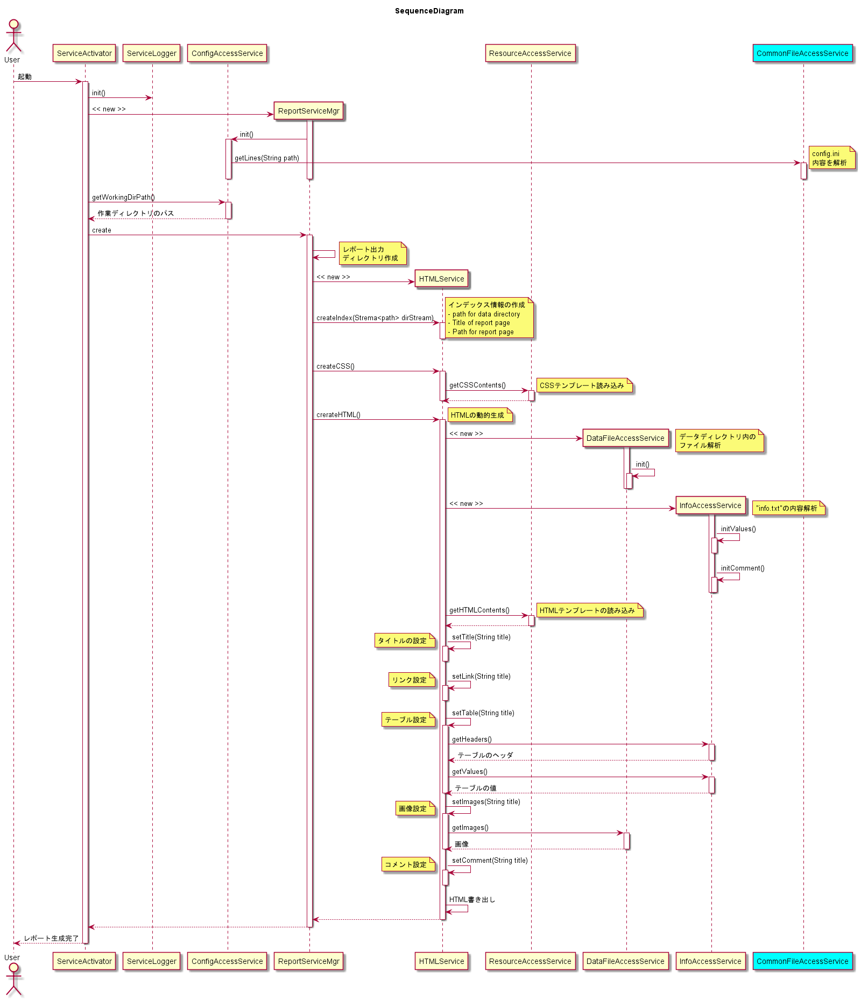

# WebRpt
## ■ 概要
任意の項目を備えたテーブルと画像データ、および自由記述の内容が掲載されたHTMLページを  
自動化するためのツール。  

## ■ 使い方
1. 下記のディレクトリ構成でデータを配置  
`root`, `title`, `xxx`は、いずれも任意の名前。`root`は作業ディレクトリ。  
`title`のディレクトリ単位で、同名のタイトルが付されたレポートページが生成される。  
ただしディレクトリ名が"report_"から始まる場合は生成対象データとして認識されない。  
画像はjpg,pngのみ対応。  
```
${root}/
  │
  ├ ${title}/
  │   ├ ${xxx}.jpg
  │   ├ ${xxx}.png
  │   └ info.txt
  │
  └ ${title}/
      └ 同じ構成
```

2. **config.ini** の設定を更新  
`root`は手順1同じ作業ディレクトリのパス。`xxx`はテーブルのヘッダにする任意の文字列で  
最大<font color="Red">**9**</font>個まで設定可能。上限を超えてヘッダを指定してもレポートページに反映されない。  
中途半端な数だと思われるかもしれないが、異論は受け付けない。  
```
path=${root}
table=${xxx},${xxx},${xxx},...
```

3. **info.txt** の内容を更新  
`PARAMS:`タグに指定する`xxx`は、手順2の`config.ini`で指定したテーブルヘッダに対応する値。  
半角スペースで区切る。なぜヘッダと区切文字が違うのかと疑問かもしれないが、異論は（以下略）。  
こちらも最大で<font color="Red">**9**</font>個までしか設定は有効ではないが、ヘッダの数と  
一致している必要はない。コメント本文は`#Comment`タグの次の行以降から開始する。  
```
PARAMS:${xxx} ${xxx} ${xxx}...
#Comment
コメントコメントコメント
```

4. **WebRpt.jar** を実行  
作業ディレクトリのパスをコマンド引数にすればよかったとか思ってないんだからね。  

## ■ 設計
- 
- 

## その他の制限事項
- 最終ページの`NEXT`ボタンを押すと、ないはずの次ページを開いてしまう。  